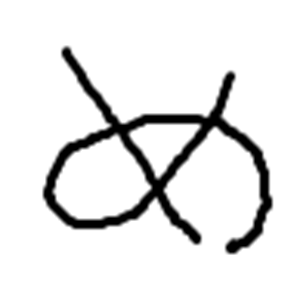
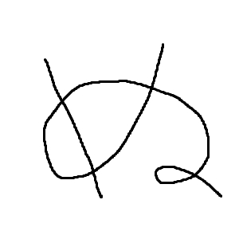

# about me

MMRZ / memories

- 競技プログラミング（Algo/Heuristic/GameAI）
- CTF（Cryptography専）

# Accounts

[Twitter](https://twitter.com/MM_RZ_AC) メインアカウント

[Twitter(Alt)]() 趣味用のアカウントを作成予定

[Github](https://github.com/Memories-of-Sun-and-Moon)

[AtCoder](https://atcoder.jp/users/M3_cp) Algo:1704, Heuristic:1439

[SIGNATE](https://signate.jp/profile) Intermediate

[guruguru](https://www.guruguru.science/MMRZ)

[Zenn](https://zenn.dev/mmrz) プログラミングコンテストをはじめとした、様々なコンペの参加記

[Qiita](https://qiita.com/MMRZ_) 公式ドキュメント等の反芻等

[connpass](https://connpass.com/user/MMRZ/)

[CTFtime](https://ctftime.org/user/139292) 

# Activities

## 2023

### 12/17 [AI Competition] atmaCup #16 in collaboration with RECRUIT

[123rd / 666](https://www.guruguru.science/competitions/22/)

### 11/11 [Algo] トヨタ自動車プログラミングコンテスト2023#7(AtCoder Beginner Contest 328)

[411th / 10710](https://atcoder.jp/users/M3_cp/history/share/abc328)

### 8/17~8/31 [Internship/Hackathon] Progate

[link](https://progate.connpass.com/event/289840/)

[成果物](https://github.com/Memories-of-Sun-and-Moon/tweet_app_for_path_intern_A_team)

### 5/4~5/6 [CTF] WaniCTF 2023

[60th / 840](https://ctftime.org/event/1988)

### 4/29 [Algo] ユニークビジョンプログラミングコンテスト2023 春 (AtCoder Beginner Contest 300)

[259th / 8155](https://atcoder.jp/users/M3_cp/history/share/abc300)

### 4/22~4/27 [CTF] ångstromCTF 2023

[199th / 1301](https://ctftime.org/event/1859)

### 4/22 [CTF] Ricerca CTF 2023

[47th / 187](https://ctftime.org/event/1920)

### 2/26 [Heuristic] RECRUIT 日本橋ハーフマラソン 2023冬（AtCoder Heuristic Contest 018

[235th / 2577](https://atcoder.jp/users/M3_cp/history/share/ahc018)

## 2020

### 2/8~2/9 [Algo] 第 19 回日本情報オリンピック (JOI 2019/2020)

[本選出場](https://www2.ioi-jp.org/joi/2019/2020-ho-invited-list.html)

## 2019

### 12/22 [Algo] AtCoder Beginner Contest 148

[53rd / 5375](https://atcoder.jp/users/M3_cp/history/share/abc148)

### 12/7 [Heuristic] HACK TO THE FUTURE 2020

[本選出場（Youth枠による招待）](https://atcoder.jp/contests/future-contest-2020-final)

### 2/9~2/10 [Algo] 第 18 回日本情報オリンピック (JOI 2018/2019)

[本選出場](https://www2.ioi-jp.org/joi/2018/2019-ho-invited-list.html)

## 2018

### 2/10~2/11 [Algo] 第 17 回日本情報オリンピック (JOI 2017/2018)

[本選出場](https://www2.ioi-jp.org/joi/2017/2018-ho-invited-list.html)